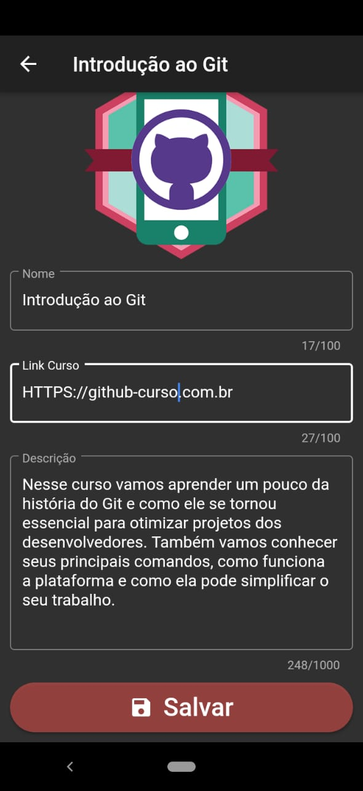
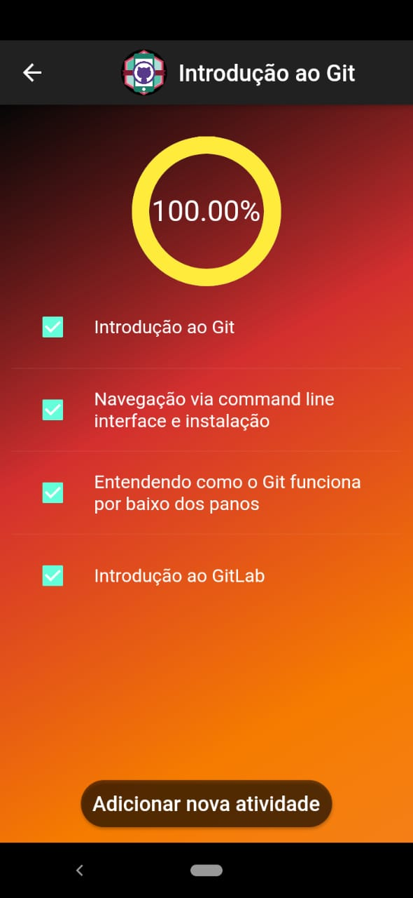
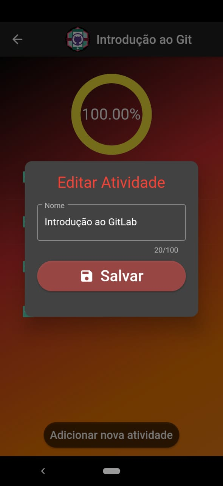

# Meu Cronograma

Projeto com Flutter para criação de um app com seguinte proposito:

* Possibilitar a gestão do andamento de cursos.
* O projeto contém CRUD dos cursos e das atividades, e gerenciamento do progresso do andamento do curso.

## Aplicativo

    
    
    
    
    
    

## Inicializar o projeto

Para inicializar o projeto basta realizar os seguintes passos:
1. Ir para o diretório do projeto
2. Possuir o Flutter instalado
3. Executar o comando: <code>flutter doctor</code> no terminal.
    No local <b>Connected device</b> caso contenha <b> !No devices available </b>, então deverá conectar o dispositivo móvel no computador ou subir um emulador.
4. Executar o comando: <code>flutter run</code>

## Funcionalidades

* CRUD Cursos
* CRUD Atividades
* Registrar o progresso do andamento do curso.

## Assuntos abordados

* ListView
* ListTile/CheckboxListTile
* SafeArea, Column, Row, Expanded
* Navigation
* State Manager(setState, MobX)
* Form
* Form Fields
* Text, Button, Image
* Dialog
* Alterar Logo, Splash Screen e nome.
* Tests
* [Progress Indicator](https://pub.dev/packages/percent_indicator)
* [ImagePicker](https://pub.dev/packages/image_picker)
* [Slidable](https://pub.dev/packages/flutter_slidable)
* [WebView](https://pub.dev/packages/webview_flutter)
* [SQLite](https://pub.dev/packages/sqflite)

## Principais pacotes
* [Modular](https://pub.dev/packages/flutter_modular)
* [Mobx](https://pub.dev/packages/mobx)
* [Slidy](https://github.com/Flutterando/slidy)
